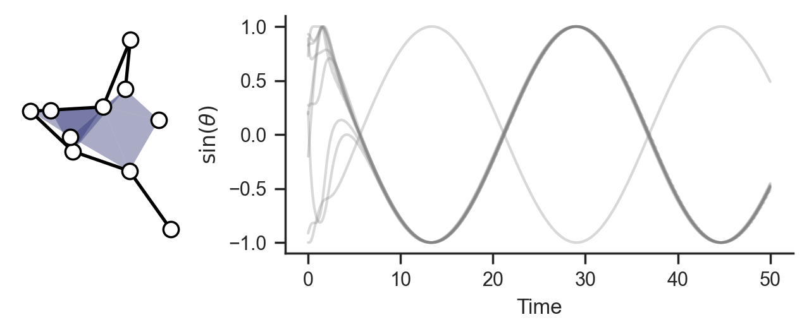

Getting started
===============

Here is a minimal example simulating Kuramoto oscillators with pairwise
and triplet interactions on a random hypergraph:

.. code-block:: python

   import matplotlib.pyplot as plt
   import numpy as np
   import xgi

   import hypersynchronization as hs

   N = 10 # number of nodes
   rng = np.random.default_rng(42) # random seed for reproducibility

   # generate hypergraph
   H = xgi.fast_random_hypergraph(N, ps=[0.1, 0.05], seed=rng) 
   links = H.edges.filterby("order", 1).members()
   triangles = H.edges.filterby("order", 2).members()

   # set dynamics parameters
   k1, k2 = 3, 1
   omega = rng.normal(0.2, 0.1, N)
   theta_0 = hs.generate_state(N, kind="random", seed=rng)

   # simulate dynamics
   thetas, times = hs.simulate_kuramoto(
       H,
       omega=omega,
       theta_0=theta_0,
       t_end=50,
       dt=0.1,
       rhs=hs.rhs_23_sym,
       integrator="RK45",
       args=(k1, k2, links, triangles),
   )

   # visualize results
   fig, (ax1, ax2) = plt.subplots(
       1, 2, width_ratios=[1, 3], figsize=(5, 2), layout="constrained", 
   )

   # draw hypergaph
   pos = xgi.barycenter_spring_layout(H, seed=20)
   xgi.draw(H, ax=ax1)

   # draw timeseries
   hs.plot_series(thetas, times, ax=ax2, alpha=0.3)

   sb.despine()
   plt.show()

